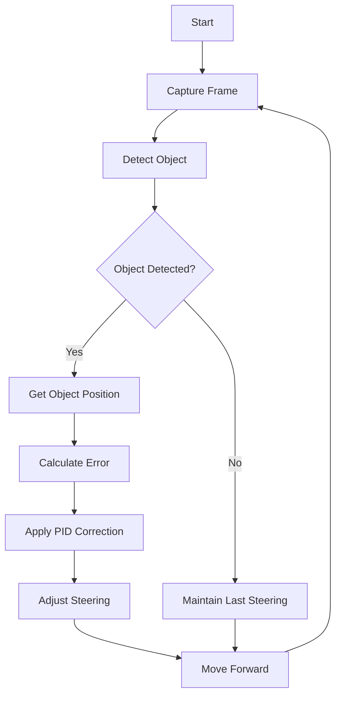
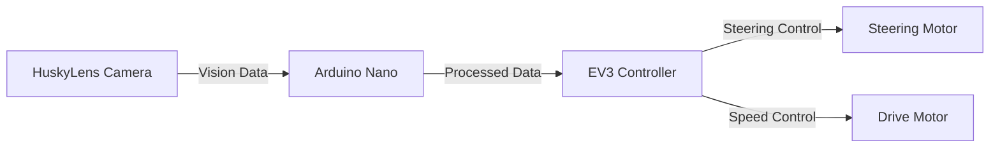

## This repository contains the official documentation of Team "Los Grises Jr" for the Future Engineers category at the World Robot Olympiad 2026.

  

---

##  Team Members

### **Mateo Briones**  
---

###  **Role:** Electronics Specialist

**2 years ago in my high school, I began to be interested in my robotics and computer science classes, so that year i went to compete in the robocup 2025
and i decided to focus on that, then i started to get interested and see it as a fun hobby, in this competition I want to win one of the first three places and
have a big prize.**

**Age:** 14
---
### **Ruth García**  
**Role:** Builder

**Age:** 15
---
### **Renato Medina**

**Role:** Programmer

**I started two years ago in my elementary school, at OnStage TMR, and from there I became interested in robotics, in this competition, I want to become a better and more well-rounded programmer.**

**Age:** 14
---
##  Project Overview
---
This project presents the development of an autonomous vehicle designed for the Future Engineers category of the World Robot Olympiad 2026.

The robot is capable of navigating a dynamic environment using a combination of computer vision and closed-loop control systems.

The system integrates:

- Real-time vision processing
- Ackermann steering geometry
- PID-based control

This combination enables stable, precise, and adaptive navigation.

##  Robot Description

The robot is based on an Ackermann steering system, similar to real-world vehicles.

### Why Ackermann Steering?

Compared to differential drive systems, Ackermann steering provides:

- Reduced lateral wheel slip
- Improved curve accuracy
- More realistic motion behavior
- Greater stability at higher speeds

A dedicated motor controls the steering angle, allowing fine adjustments during navigation.

Ackermann steering was selected to better replicate real-world vehicle dynamics and minimize lateral slip during turns, resulting in smoother and more accurate trajectories.
---
## Vehicle Photo

| Front | Back |
|:--:|:--:|
| |  |
| Bottom | Left |
|  |  |
| Right | Top |
| |  |
---
##  Components and Hardware
| Component | Description | Image |
|-----------|-------------|-------|
| **45544 LEGO MINDSTORMS Education EV3 Core Set** | Forms the foundational structure and chassis. |  |                       
| **Arduino Nano** | ATmega328-based microcontroller for control tasks. |  |
| **DFRobot HuskyLens AI Camera** | AI-powered vision sensor capable of detecting colors, objects, and patterns in real time. |  |
---
## Control System Architecture

The system is divided into two main subsystems:

1. Vision Processing (Arduino Nano)

- Receives data from the HuskyLens camera
- Detects object color (red/green)
- Extracts horizontal position of the object
- Sends processed data to the EV3

2. Motion Control (EV3)

- Receives processed data
- Controls steering motor and drive motor

| **Data Flow** |
| :---------------: |
|HuskyLens → Arduino Nano → EV3 → Motors|

### Communication Protocol

Communication between the Arduino Nano and EV3 is performed via serial (UART).

- Data transmitted: object horizontal position (x-coordinate)
- Update rate: approximately 30 Hz
- Data format: integer values

This separation allows the EV3 to focus on motion control while the Arduino handles vision processing.

This ensures low-latency data transmission, which is critical for real-time control.

A custom PCB was developed to:

- Improve connection stability
- Reduce wiring complexity
- Increase reliability during runs
---
## Control Algorithm

he robot uses a hybrid control algorithm that combines computer vision and ultrasonic sensing.

Vision is used for obstacle detection and avoidance, while ultrasonic sensors are used for lane centering when no obstacle is detected.
Process:

- Capture frame from HuskyLens
- Detect object color
- Obtain object horizontal position
- Compute positional error
The error is calculated based on the difference between the object position and the center of the image.  

- Apply control correction
- Adjust steering angle
- Move forward
A unified PD controller is used regardless of the active sensing mode.

### pseudocode
loop:

    if object_detected and width > threshold:
        # Vision mode
        error = setpoint - x_position
    else:
        # Ultrasonic mode
        error = right_distance - left_distance

    derivative = error - previous_error
    output = Kp * error + Kd * derivative

    output = clamp(output, -30, 30)

    steering = output
    speed = constant

    previous_error = error

### Behavior Logic:

- Object centered → move forward
- Object left → steer left
- Object right → steer right
  
If no object is detected, the robot switches to ultrasonic-based control to maintain lane position.
---
## Steering Control (PID)

To achieve stable and precise steering, a PID controller is being implemented.

**Control Objective:**

Minimize the horizontal deviation between the detected object and the center of the image.
The steering is controlled using a PID-based approach:

- The proportional term reacts to the current error, providing immediate correction
- The integral term compensates accumulated error over time (currently disabled)
- The derivative term reduces oscillations by responding to rapid changes in error

The integral component was intentionally set to zero to prevent instability caused by noise in the vision system.

The error represents the horizontal distance between the detected object and the center of the image.
 
| Parameters | Value |
| :--------: | :---: |
| KP         | 2.0   |
| KI         | 0.0   |
| KD         | 0.5   |

u(t) = Kp * e(t) + Kd * (de/dt)

Where:
- u(t): steering output  
- e(t): error (object position - center)  
- de/dt: rate of change of error
  
In implementation, the derivative term is approximated using discrete differences:

D = error - previous_error
  
The controller is currently being tuned to achieve a balance between responsiveness and stability.
---
### Comparison with Non-PD Control

Initial tests without derivative control showed:

- Higher oscillations
- Overshooting when correcting trajectory

After implementing PD control:

- Smoother steering behavior
- Reduced oscillations
- Improved trajectory stability

---

## Vision System

The robot uses a HuskyLens AI camera connected to an Arduino Nano.

Capabilities:

Detection of red and green pillars
Real-time object tracking
Position data extraction

Design Considerations:

- Elevated camera placement increases field of view
- Early detection improves reaction time
- Reduces sudden steering corrections

The system operates in a closed-loop configuration, where visual feedback is continuously used to correct the robot's trajectory in real time, improving robustness against disturbances and dynamic changes in the environment.
---

## Navigation Strategy

The robot uses vision-based navigation to interact with obstacles dynamically.

- Detects colored pillars  
- Determines relative position  
- Adjusts trajectory using steering control  

This approach allows smooth and adaptive movement around obstacles.
## Navigation Algorithm
The navigation process is implemented as a continuous loop, as shown below:

---
## Engineering Decisions

### Ackermann Steering Selection

Ackermann steering was selected instead of differential drive due to its ability to:

- Reduce lateral slip during turns
- Provide more accurate trajectory tracking
- Better replicate real-world vehicle dynamics

This choice improves performance at higher speeds and increases stability in curved paths.

### Distributed Architecture (Arduino + EV3)

The system was divided into two subsystems:

- Arduino Nano → Vision processing
- EV3 → Motion control

This decision was made to:

- Reduce computational load on the EV3
- Improve real-time performance
- Allow modular development and easier debugging

### Use of PD Controller

A PD controller was implemented instead of a full PID controller.

- Proportional term (KP): provides immediate correction based on current error
- Derivative term (KD): reduces oscillations by reacting to error changes
- Integral term (KI): intentionally set to zero

The integral component was disabled due to:

- Noise in the vision system
- Risk of error accumulation (integral windup)
- Unstable behavior observed during initial testing

### Camera Placement

The camera was positioned at an elevated point to:

- Increase field of view
- Allow earlier detection of objects
- Reduce sudden steering corrections

This improves reaction time and overall navigation smoothness.

### Communication via UART

Serial communication was selected due to:

- Simplicity of implementation
- Low latency
- Compatibility between Arduino Nano and EV3
- Baud rate: 9600 
- Simple protocol: single integer per frame

The system transmits only essential data (object position), minimizing bandwidth usage and improving update rate.

---
## Performance 

Initial testing shows:

- The robot maintains a stable trajectory with an average deviation of approximately ±8 pixels from the target center. 
- Reduced oscillations compared to initial non-PID control tests
- Reliable response to changes in object position  

Further testing and quantitative evaluation are currently in progress.

---
## Technical Analysis

A deeper analysis of the system performance was conducted to evaluate stability, accuracy, and robustness under different conditions.

### Error Behavior

The system maintains an average error of approximately ±8 pixels, with peaks up to 20 pixels in more demanding scenarios such as sharp turns or late object detection.

Higher error values are mainly observed when:
- The object enters the field of view abruptly
- The robot operates at higher speeds
- Lighting conditions introduce noise in detection

### Stability

The implementation of the PD controller significantly reduced oscillations compared to initial tests without derivative control.

- Without derivative term: noticeable oscillations and overcorrection
- With derivative term: smoother response and improved stability

### Response Time

The system presents an average response time of approximately 120 ms, which is sufficient for real-time correction at the current operating speed.

However, small delays were observed due to:
- Serial communication latency (Arduino → EV3)
- Vision processing time

### Limit Case Behavior

When no object is detected:
- The robot maintains the last steering value
- This prevents abrupt movements but may introduce accumulated deviation if the object is lost for extended periods

### Performance vs Speed Trade-off

An increase in speed results in:
- Faster track coverage
- Reduced reaction time window
- Higher probability of error peaks

This indicates a trade-off between speed and accuracy that must be balanced depending on competition conditions.
---
## Experimental Results

Preliminary testing was conducted under controlled lighting conditions.
Each test consisted of multiple runs to ensure consistency in the measured results.

| Metric | Value |
| :----: | :---: |
| Average error | ±8 px |
| Maximum error | 20 px |
| Response time | ~120 ms |
| Processing rate | ~30 FPS |

These results indicate stable tracking performance and consistent response to changes in object position.

## Challenges

- Integration between EV3 and Arduino systems  
- Achieving stable Ackermann steering control  
- Handling noise in vision detection  
- Tuning PID parameters  
---
## Limitations

- Performance may decrease under variable lighting conditions due to vision noise  
- Limited field of view of the camera affects early detection in some scenarios  
- Small communication delays between subsystems can impact response time

---
## Conclusion

The Los Grises Jr robot integrates:

- Realistic Ackermann steering
- Intelligent vision processing
- PID-based control

The system demonstrates the effective integration of perception and control, implementing a real-time closed-loop navigation strategy.

This combination enables stable and adaptive navigation, preparing the team for dynamic competition environments.

## System Diagram

---

                      
