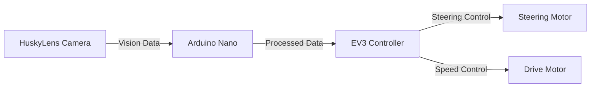
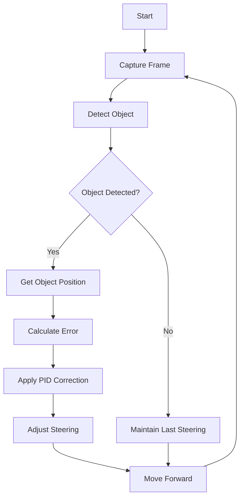

## System scheme

```mermaid
flowchart LR
    A[HuskyLens Camera] -->|Vision Data| B[Arduino Nano]
    B -->|Processed Data| C[EV3 Controller]
    C -->|Steering Control| D[Steering Motor]
    C -->|Speed Control| E[Drive Motor]
```
---

## Algorythm scheme

```mermaid
flowchart TD
    A[Start] --> B[Capture Frame]
    B --> C[Detect Object]
    C --> D{Object Detected?}
    
    D -- Yes --> E[Get Object Position]
    E --> F[Calculate Error]
    F --> G[Apply PID Correction]
    G --> H[Adjust Steering]
    H --> I[Move Forward]
    
    D -- No --> J[Maintain Last Steering]
    J --> I
    
    I --> B
```
---
